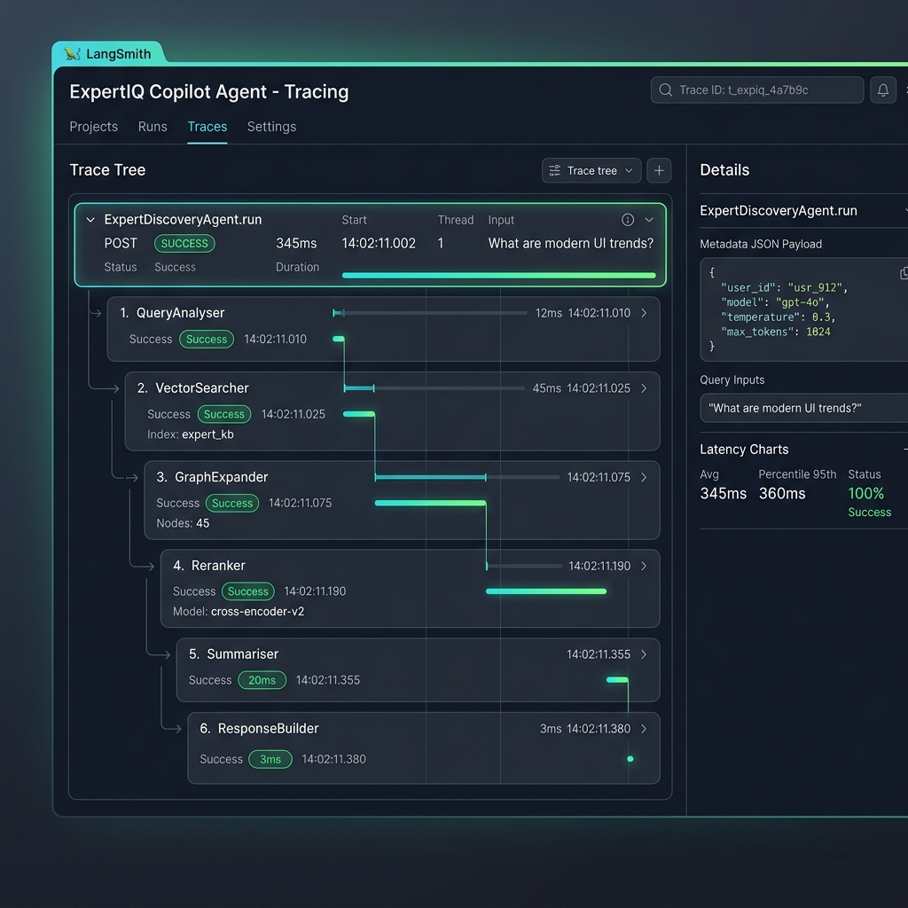

# 🧠 ExpertIQ Copilot

> **Enterprise-Grade Expert Discovery & Research Intelligence Platform**

[](https://python.org)
[](https://fastapi.tiangolo.com)
[](https://nextjs.org)
[](https://langchain.com)
[](https://redis.io)
[](https://trychroma.com)

---

## 🚀 Architectural Vision & Key Solutions

Expert network platforms rely on connecting investment researchers, consultants, and companies with highly specialized subject-matter experts. Standard keyword-based searches frequently fail to capture contextual alignment for highly specific queries.

**ExpertIQ Copilot** solves this by orchestrating a high-performance **3-layer hybrid search pipeline** wrapped in a secure, authenticated, and cached enterprise-grade API, capable of running smoothly on standard local machines or scale-out production clusters.

```
┌─────────────────────────────────────────────────────────────┐
│                    Next.js 16 Frontend                      │
│  ┌──────────┐  ┌──────────┐  ┌─────────┐  ┌──────────────┐ │
│  │ SearchBar│  │ExpertCard│  │ GraphViz│  │  Executive   │ │
│  │          │  │  (Score) │  │  (D3/   │  │  Summary     │ │
│  │          │  │  + AI    │  │  Canvas)│  │  Panel       │ │
│  └──────────┘  └──────────┘  └─────────┘  └──────────────┘ │
└───────────────────────┬─────────────────────────────────────┘
                        │ REST API (JWT + Redis Rate Limiter)
┌───────────────────────▼─────────────────────────────────────┐
│                   FastAPI Backend                           │
│                                                               │
│  ┌─────────────────────────────────────────────────────────┐ │
│  │              LangGraph AI Agent Pipeline                  │ │
│  │                                                           │ │
│  │  ┌──────────┐  ┌──────────┐  ┌──────────┐              │ │
│  │  │  Query   │→ │  Vector  │→ │  Graph   │              │ │
│  │  │ Analyser │  │ Searcher │  │ Expander │              │ │
│  │  └──────────┘  └──────────┘  └──────────┘              │ │
│  │       ↓              ↓              ↓                    │ │
│  │  ┌──────────┐  ┌──────────┐  ┌──────────┐              │ │
│  │  │Reranker  │→ │Summariser│→ │Response  │              │ │
│  │  │(Groq LLM)│  │(Groq LLM)│  │ Builder  │              │ │
│  │  └──────────┘  └──────────┘  └──────────┘              │ │
│  └─────────────────────────────────────────────────────────┘ │
│                                                               │
│  ┌────────────┐  ┌──────────┐  ┌──────────┐  ┌─────────────┐  │
│  │  ChromaDB  │  │ NetworkX │  │PostgreSQL│  │ Redis Cache │  │
│  │  (Vectors) │  │  (Graph) │  │   (ORM)  │  │ (Failover)  │  │
│  └────────────┘  └──────────┘  └──────────┘  └─────────────┘  │
└──────────────────────────────────────────────────────────────┘
```

---

## ⚡ The 3 Hybrid Retrieval Layers

| Layer | Architecture | Mechanics |
| :--- | :--- | :--- |
| **1. Semantic Search** | `sentence-transformers` + `ChromaDB` | Embeds expert biographies and queries into a local vector space using lightweight ONNX runtime embeddings, resolving nearest-neighbors via cosine similarity. |
| **2. Relation Network** | `NetworkX` | Models deep multi-hop connections (Expert ↔ Company ↔ Industry ↔ Skill) using a local in-memory graph layer, surfacing contextually relevant secondary connections. |
| **3. Re-ranking Agent** | `LangGraph` + `Groq` (`Llama-3.3-70B`) | Scores and ranks candidates from 1 to 10 with clear AI reasoning, synthesizing a concise executive summary of top-tier matches. |

---

## 🔍 LangSmith Tracing & Observability

To achieve production-grade reliability and debug alignment latency, **ExpertIQ Copilot** fully integrates **LangSmith Tracing**. Every invocation of the `ExpertDiscoveryAgent` creates a single parent span, which wraps and nestedly traces all **6 orchestration nodes** chronologically:

1. **QueryAnalyser**: Extracts search intent, key topics, and detected industries.
2. **VectorSearcher**: Queries ChromaDB/FastEmbed for high-probability semantic candidates.
3. **GraphExpander**: Explores multi-hop relation networks via NetworkX graph connections.
4. **Reranker**: Employs Groq LLM reasoning to evaluate candidate scores (1-10) and logic.
5. **Summariser**: Formulates a clear executive research summary of top candidates.
6. **ResponseBuilder**: Constructs structured JSON response payloads.

### Nested Execution Spans in LangSmith
Below is the trace tree showing precise latency, query inputs, and success statuses across all nodes:



---


## 🛡️ Enterprise-Grade Security & System Optimizations

### 1. Robust Injection Protection
- **Multi-Field Sanitization**: Built-in Pydantic validators leverage `bleach` to dynamically strip out and sanitize HTML, script tags, and prompt-injection payloads from search queries and nested `filters` fields.
- **SQL & Vector Injection Immunity**: Strictly relies on SQLAlchemy parameter binding and vector similarity spaces, entirely preventing raw query concatenations.

### 2. Dual-Engine Caching & Resiliency
- **Secure Per-User Cache**: Implements user-partitioned caching to prevent cross-user data leakage.
- **Graceful Failover Manager**: Configured to write and read from **Redis** if running, but automatically switches to local in-memory **TTLCache** on failure.

### 3. Dedicated Rate Limiting
- **Brute-Force & Abuse Defense**: Limits search operations (10/min) and auth checkpoints (5/min) per IP/User.
- **Failover Safe**: Powered by Redis with automatic fallback to local memory, and fully bypassed inside automated test suites for smooth CI pipelines.

### 4. Direct Bcrypt Authentication
- **Modern Python 3.14+ Compatibility**: Replaced legacy, slow, and buggy wrapper frameworks (e.g. `passlib`) with native, highly optimized, direct `bcrypt` calls.

---

## 🛠️ Production Tech Stack

- **API Engine**: `FastAPI 0.136+`
- **Agent Framework**: `LangGraph` + `LangChain`
- **Vector Search**: `ChromaDB` (Local Persistent) + `FastEmbed` (ONNX Runtime)
- **Graph Processor**: `NetworkX`
- **Caching & Rate Limiting**: `Redis` (Failover Support) + `slowapi`
- **Relational Storage**: `PostgreSQL` + `SQLAlchemy 2.0+`
- **Frontend App**: `Next.js 16 (App Router)` + `React 19` + `Tailwind CSS 4` + `3D Canvas (Three.js)`
- **DevOps**: `Docker` + `Docker Compose`

---

## 📦 Quick Start & Installation

### 1. Prerequisites
- **Python 3.14+** or **Node.js 20+**
- **Redis Server** (Optional: fallbacks to in-memory)
- **Groq API Key** (Obtain free at [console.groq.com](https://console.groq.com))

### 2. Standard Local Run (Highly Optimized)

#### Backend Setup
```bash
# 1. Navigate to backend
cd backend

# 2. Initialize virtual environment and activate
python3 -m venv venv
source venv/bin/activate

# 3. Install relaxed dependencies
pip install -r requirements.txt

# 4. Start the FastAPI development server
venv/bin/python3 -m uvicorn app.main:app --reload --host 127.0.0.1 --port 8000
```

#### Frontend Setup (New Terminal Window)
```bash
# 1. Navigate to frontend
cd frontend

# 2. Install modern npm dependencies
npm install

# 3. Build and launch Next.js development server
npm run dev
```

Open [http://localhost:3000](http://localhost:3000) inside your web browser. Create a new user profile to immediately access the interactive search, curate pipelines, and explore the **3D D3 force-directed knowledge graph**!

### 3. Docker Compose (Alternative)
```bash
# Clone the repository
git clone https://github.com/jeevesh2515/expertiq-copilot.git
cd expertiq-copilot

# Initialize configurations
cp .env.example .env

# Build and start services
docker-compose up --build
```

---

## 🧪 Comprehensive Verification & Test Runner

The entire system is backed by comprehensive integration and unit test suites:

```bash
cd backend
# Run all tests
venv/bin/pytest tests/ -v
```

```text
======================== 33 passed, 7 warnings in 2.51s ========================
```

To run a production-ready Next.js compilation check:
```bash
cd frontend
npm run build
```

---

## 📁 Directory Architecture

```text
expertiq-copilot/
├── backend/
│   ├── app/
│   │   ├── main.py              # FastAPI application lifecycle & middlewares
│   │   ├── config.py            # Pydantic-settings config loaders
│   │   ├── auth/                # Optimized JWT handlers & dependencies
│   │   ├── api/                 # REST Controller routes
│   │   ├── core/                # Hybrid search engines & LangGraph Agent
│   │   │   ├── agent.py         # 6-node LangGraph orchestration
│   │   │   ├── cache.py         # Graceful Redis Cache Manager
│   │   │   ├── limiter.py       # Resilient IP/User rate-limiting config
│   │   │   └── lightweight_search.py # Low-load PostgreSQL search engine
│   │   └── models/              # SQLAlchemy Database ORMs
│   └── tests/                   # Pytest test suites (33 tests)
├── frontend/
│   ├── src/
│   │   ├── app/                 # Next.js App Router layout & views
│   │   └── components/          # ForceGraph3D & React components
│   └── package.json
└── docker-compose.yml
```

---

*Built with ❤️ using Next.js 16, FastAPI, Redis, ChromaDB, and LangGraph.*
