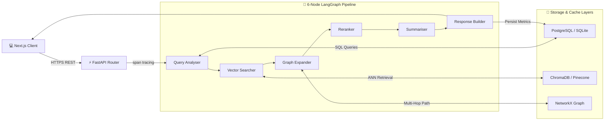

# ExpertIQ Copilot

> **Enterprise-Grade Expert Discovery, Hybrid Retrieval, & Research Intelligence Platform**

ExpertIQ Copilot is a production-ready, highly-optimized expert discovery platform. It replaces naive search pipelines with a resilient **6-node LangGraph agent network**, dual relational-vector databases, multi-tier fallback caching, and production-grade observability telemetry.

---

## 🗺️ System Architecture

The workflow traces how a user query flows from the frontend client to the backend database, vector, graph, and LLM nodes, returning as a grounded, context-enriched expert discovery profile:



### 🧠 LangGraph Orchestration Nodes

* **Query Analyser**: Parses natural language, extracts query intents and metadata filter constraints.
* **Vector Searcher**: Generates hypothetical document embeddings (HyDE) and executes metadata-filtered queries.
* **Graph Expander**: Traverses the in-memory NetworkX relational graph for multi-hop expert connection expansions.
* **Reranker**: Performs dynamic grounding lookups, scoring candidates (1-10) using structured LLM criteria.
* **Summariser**: Constructs professional, high-fidelity research summaries grounded in retrieved expert bios.
* **Response Builder**: Assembles dual-compatible REST payloads and captures/logs performance and usage metrics.

---

## 🚀 Key Features

* **Parent-Child Semantic Chunking**: Segment biographies into child sentences for precise, sentence-level matching, then retrieve broader parent text paragraphs to feed cohesive context to the LLM.
* **Self-Querying Metadata Filtering**: Parses natural language filters (e.g. *"Fintech expert with 15+ years experience"*) into database-native comparison operator trees to bypass ANN vector post-filtering limitations.
* **Hypothetical Document Embeddings (HyDE)**: Generates a synthetic expert biography representing the perfect candidate to align query intents directly with document structural layouts to boost retrieval recall.
* **Dynamic Database Auto-Migrations**: Dynamically inspects column mappings on startup and executes SQLAlchemy 2.0-compliant DDL alters to update databases seamlessly on boot.

---

## 🛠️ Getting Started

### 1. Configure Environment
Copy the environment template in the root directory:
```bash
cp .env.example .env
```
Provide your `GROQ_API_KEY` (obtain free at [console.groq.com](https://console.groq.com)). The platform boots in **`lightweight`** mode by default, running zero-downloads vector matching completely locally over your relational database for instant development!

### 2. Start Backend (Python 3.11+)
```bash
cd backend
python3 -m venv venv
source venv/bin/activate
pip install --upgrade pip
pip install -r requirements.txt
venv/bin/python -m uvicorn app.main:app --reload --host 127.0.0.1 --port 8000
```
*Note: Database tables, seeded expert profiles, and the NetworkX knowledge graph will build automatically on boot.*

### 3. Start Frontend (Node 20+)
```bash
cd frontend
npm install
npm run dev
```
Open [http://localhost:3000](http://localhost:3000) to access the interactive dashboard, search experts, and explore the **3D Force-Directed D3 Knowledge Graph**!

---

## 🔍 Observatory Tracing & Evaluation

### 1. Syncing Tracing
To activate real-time LangSmith telemetry tracing, add your LangSmith API key to your local `.env`:
```env
LANGCHAIN_TRACING_V2=true
LANGCHAIN_ENDPOINT=https://api.smith.langchain.com
LANGCHAIN_API_KEY=your_langsmith_api_key_here
LANGCHAIN_PROJECT=expertiq-copilot
```

### 2. Running Automated RAG Evaluators
We have implemented two zero-cost pathways to continuously evaluate the quality of your RAG outputs.

#### Programmatic Local Runs (Recommended)
Execute our fully automated programmatic benchmark runner at `backend/scripts/run_langsmith_eval.py` to run 3 free local evaluators:
```bash
cd backend
source venv/bin/activate
python scripts/run_langsmith_eval.py
```
This logs the entire experiment to the **Datasets & Experiments** tab of your LangSmith account for free!

#### Web UI Custom Evaluators (Copy-Paste)
Navigate to **LangSmith Dashboard** -> **Evaluators** -> Select **Custom Evaluator (Python Code)**. 

> [!IMPORTANT]
> LangSmith's code runner strictly expects the main function to be named exactly **`perform_eval(run, example=None)`**. If named differently, validation will fail.

<details>
<summary><b>🛡️ Click to expand Expert Fidelity Evaluator</b></summary>

```python
def perform_eval(run, example=None) -> dict:
    results = run.outputs.get("results", []) or []
    summary = (run.outputs.get("executive_summary") or "").lower()
    if not summary or not results: return {"key": "expert_fidelity", "score": 1.0}
    retrieved = set()
    for item in results:
        name = item.get("name")
        if name:
            retrieved.add(name.lower())
            retrieved.update(name.lower().split())
    all_known = ["sarah connor", "john connor", "marcus wright", "marcus williams"]
    hallucinations = [n for n in all_known if n in summary and not any(part in retrieved for part in n.split())]
    if hallucinations: return {"key": "expert_fidelity", "score": 0.0, "comment": f"Hallucination: {', '.join(hallucinations)}"}
    return {"key": "expert_fidelity", "score": 1.0}
```
</details>

<details>
<summary><b>📐 Click to expand Grounding Precision Evaluator</b></summary>

```python
def perform_eval(run, example=None) -> dict:
    outputs = run.outputs
    if not outputs: return {"key": "grounding_precision", "score": 1.0}
    results = outputs.get("results", []) or []
    if not results: return {"key": "grounding_precision", "score": 1.0}
    for res in results:
        parent_text = res.get("parent_text") or ""
        text = res.get("text") or ""
        if text and parent_text and len(parent_text) < len(text):
            return {"key": "grounding_precision", "score": 0.0, "comment": "Parent text shorter than child snippet"}
    return {"key": "grounding_precision", "score": 1.0}
```
</details>

<details>
<summary><b>🔍 Click to expand Constraint Precision Evaluator</b></summary>

```python
def perform_eval(run, example=None) -> dict:
    analysis = run.outputs.get("query_analysis", {}) or {}
    constraints = analysis.get("constraints", {}) or {}
    if not constraints: return {"key": "constraint_precision", "score": 1.0}
    min_years = constraints.get("min_years_experience")
    required_avail = constraints.get("availability")
    results = run.outputs.get("results", []) or []
    if not results: return {"key": "constraint_precision", "score": 1.0}
    violations = sum(1 for exp in results if (min_years is not None and exp.get("years_experience", 0) < min_years) or (required_avail and exp.get("availability") != required_avail))
    return {"key": "constraint_precision", "score": 1.0 - (violations / len(results)) if len(results) > 0 else 1.0}
```
</details>

---

## 🚢 Production Deployment

### 1. Production Backend (Railway)
1. Commit your changes and push them to your GitHub repository.
2. In your **[Railway Dashboard](https://railway.app)**, select your project and navigate to the **Variables** tab on your backend service.
3. Inject the LangSmith variables and your production database credentials.
4. The backend increase of `"healthcheckTimeout": 300` in [railway.json](backend/railway.json) ensures Railway has enough time on cold boots to download models from HuggingFace and index profiles successfully.

### 2. Production Frontend (Vercel)
1. Connect your repository to your **[Vercel Dashboard](https://vercel.com)**.
2. Add the environment variable `NEXT_PUBLIC_API_URL` pointing to your active Railway backend URL.
3. Click deploy!

---

## 🧪 Verification & Test Command Matrix

| Target | Command | Purpose |
| :--- | :--- | :--- |
| **All Backend Tests** | `cd backend && venv/bin/pytest tests/ -v` | Runs the full 47-case integration and unit test suite |
| **RAG Triad Test Only** | `cd backend && venv/bin/pytest tests/test_rag_eval.py -v` | Runs the isolated database RAG metric evaluations |
| **Frontend Compilation** | `cd frontend && npm run build` | Compiles Next.js React 19 pages with strict TypeScript check |

---

## 📁 Monorepo Folder Structure

```text
expertiq-copilot/
├── backend/
│   ├── app/
│   │   ├── main.py              # FastAPI application lifecycle & middlewares
│   │   ├── config.py            # Pydantic-settings config loads & standardisation
│   │   ├── database.py          # SQLAlchemy 2.0 engine & dynamic migrators
│   │   ├── api/                 # REST Routers (search, health, feedback, experts)
│   │   ├── models/              # SQLAlchemy Database ORM tables
│   │   ├── schemas/             # Pydantic JSON serialization contracts
│   │   └── core/                # Agent core routing & algorithms
│   │       ├── agent.py         # 6-node LangGraph orchestration
│   │       ├── rag_pipeline.py  # Parent-Child contextual RAG compiler
│   │       ├── lightweight_search.py # Nested operator local keyword engine
│   │       ├── vector_store.py  # Local persistent ChromaDB manager
│   │       └── vector_store_pinecone.py # Cloud Pinecone manager
│   ├── scripts/
│   │   ├── ingest_pinecone.py   # Bulk database loader script for Pinecone
│   │   └── run_langsmith_eval.py # Programmatic LangSmith evaluation runner
│   └── tests/                   # Pytest automated test runner (47 test cases)
├── frontend/
│   ├── src/
│   │   ├── app/                 # Next.js App Router views, layouts, and styles
│   │   ├── components/          # ForceGraph3D, SearchBar, ExpertDetailDrawer
│   │   └── lib/                 # API connection configurations
│   └── package.json
└── docker-compose.yml
```

---

*Built using Next.js 16, React 19, FastAPI, Redis, ChromaDB, Pinecone, and LangGraph.*
