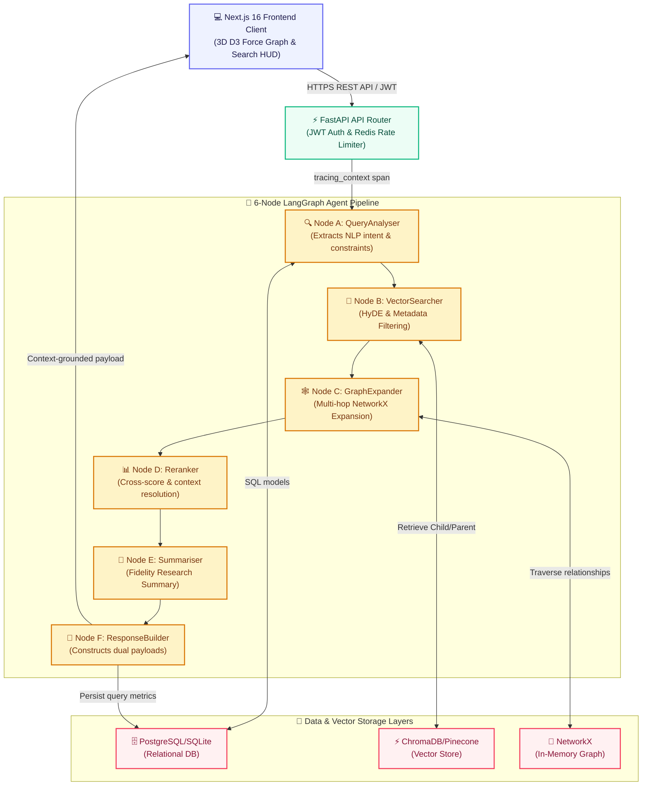

# 🧠 ExpertIQ Copilot

> **Enterprise-Grade Expert Discovery, Hybrid Retrieval, & Research Intelligence Platform**

ExpertIQ Copilot is a production-ready, highly-optimized expert discovery platform. It replaces naive search pipelines with a resilient **6-node LangGraph agent network**, dual relational-vector databases, multi-tier fallback caching, and production-grade observability telemetry.

[](https://python.org)
[](https://fastapi.tiangolo.com)
[](https://nextjs.org)
[](https://langchain.com)
[](https://redis.io)
[](https://trychroma.com)
[](https://pinecone.io)

---

## 🗺️ System Architecture Flow

The following interactive architecture diagram traces how a user query flows from the frontend client to the backend database, vector, graph, and LLM nodes, returning as a grounded, context-enriched expert discovery profile:



### 🧠 LangGraph Agent Pipelines Summary

| Node | Name | Technical Operations |
| :--- | :--- | :--- |
| **Node A** | `QueryAnalyser` | Parses natural language, extracts query intents and metadata filter constraints. |
| **Node B** | `VectorSearcher` | Generates hypothetical document embeddings (HyDE) and executes metadata-filtered queries. |
| **Node C** | `GraphExpander` | Traverses the in-memory NetworkX relational graph for multi-hop expert connection expansions. |
| **Node D** | `Reranker` | Performs dynamic grounding lookups, scoring candidates (1-10) using structured LLM criteria. |
| **Node E** | `Summariser` | Constructs professional, high-fidelity research summaries grounded in retrieved expert bios. |
| **Node F** | `ResponseBuilder` | Assembles dual-compatible REST payloads and captures/logs performance and usage metrics. |

---

## 🚀 Advanced RAG & Platform Features

This project utilizes advanced patterns designed for production-level stability and high-accuracy semantic matching:

### 1. Parent-Child Semantic Chunking
* **The Problem**: Embedding large bios or multiple-page papers directly introduces visual and semantic noise, diluting cosine similarity matching.
* **The Solution**: Biographies are segmented into short, granular sentences (**Child Chunks**). During ingestion, child chunks are embedded and stored with their `parent_id` and the complete paragraph text (`parent_text`) attached to their metadata payload.
* **The Retrieval**: Cosine similarity is computed against child chunks for high-precision, sentence-level matching. On retrieval, `RAGPipeline.retrieve_context` automatically swaps child hits with their broader `parent_text` and deduplicates them in-memory, feeding the LLM with cohesive, non-fragmented paragraph contexts.

### 2. Self-Querying Metadata Filtering
* **The Problem**: Standard Approximate Nearest Neighbor (ANN) vector queries suffer from vector post-filtering limitations, returning fewer results or violating query constraints (like years of experience).
* **The Solution**: `QueryAnalyser` parses natural language filters (e.g. *"Fintech expert with 15+ years experience"*) and extracts a structural constraint dictionary.
* **The Compilation**: `VectorSearcher` compiles these into structured, database-native comparison operator trees (e.g. `{"years_experience": {"$gte": 15}, "availability": "available"}`). The vector engine and local simulators execute these filters strictly, guaranteeing zero constraint violations.

### 3. Hypothetical Document Embeddings (HyDE)
* **The Problem**: Raw user queries are short or phrased as questions, which do not align semantically with professional resumes.
* **The Solution**: The pipeline prompts a free-tier Groq model to generate a synthetic expert biography (`hyde_bio`) representing the perfect candidate. This synthetic card is embedded and queried, aligning query intents directly with document structural layouts to boost retrieval recall.

### 4. Dynamic Database Auto-Migrations
* **The Problem**: Upgrading database schemas (like adding conversation thread tracking `thread_id` columns) usually crashes conventional engines without manual migrations.
* **The Solution**: On startup, `database.py` dynamically inspects column mappings (`PRAGMA table_info` for SQLite and `information_schema.columns` for PostgreSQL) and executes SQLAlchemy 2.0-compliant `text()` DDL statement alters with explicit transaction commits, updating production databases seamlessly on boot.

---

## 🛠️ Step-by-Step Local User Guide

### 1. Clone & Configure Environments
Copy the env template in the root workspace directory to create your local `.env`:
```bash
cp .env.example .env
```
Provide your Groq API Key (obtain free at [console.groq.com](https://console.groq.com)). 

By default, the platform boots in **`lightweight`** mode. This simulator boots in **under 5 seconds** and runs zero-downloads vector matching completely locally over your relational database, allowing instant offline development!

### 2. Backend Startup (Python 3.11+)
1. **Navigate to the backend directory**:
   ```bash
   cd backend
   ```
2. **Initialize a Python virtual environment and activate it**:
   ```bash
   python3 -m venv venv
   source venv/bin/activate
   ```
3. **Install modern production-grade dependencies**:
   ```bash
   pip install --upgrade pip
   pip install -r requirements.txt
   ```
4. **Launch the FastAPI development server**:
   ```bash
   venv/bin/python -m uvicorn app.main:app --reload --host 127.0.0.1 --port 8000
   ```
*The database tables will be initialized, 50 expert profiles seeded, and the local relation knowledge graph built automatically on boot!*

### 3. Frontend Startup (Node 20+)
1. **Navigate to the frontend directory** (in a new terminal tab):
   ```bash
   cd frontend
   ```
2. **Install node dependencies**:
   ```bash
   npm install
   ```
3. **Launch the Next.js development server with Turbopack**:
   ```bash
   npm run dev
   ```
Open [http://localhost:3000](http://localhost:3000) in your web browser. Create a new user profile to immediately access the interactive dashboard, search experts, submit feedback, and explore the **3D Force-Directed D3 Knowledge Graph**!

---

## 🔍 Observatory Tracing & Programmatic Benchmarks

### 1. Syncing Tracing in 30 Seconds
To activate real-time LangSmith telemetry tracing, add your LangSmith API key to your local `.env` file under standard keys:
```env
LANGCHAIN_TRACING_V2=true
LANGCHAIN_ENDPOINT=https://api.smith.langchain.com
LANGCHAIN_API_KEY=your_langsmith_api_key_here
LANGCHAIN_PROJECT=expertiq-copilot
```
Simply restart the backend server to immediately apply the variables. Every query you run on your local site will now register instantly under your LangSmith **Tracing** list!

### 2. Running Automated RAG Evaluators ($0.00 Cost)

We have implemented two powerful, zero-cost pathways to continuously evaluate the quality of your RAG outputs (Context Precision, Faithfulness/Hallucination, and Parent-Child chunk resolution).

#### Option A: Programmatic Local Runs (Highly Recommended)
We have written a fully automated programmatic benchmark runner at `backend/scripts/run_langsmith_eval.py`. It boots an isolated database sandbox, seeds custom metrics, synchronizes datasets, and executes 3 free local evaluators:
* **Expert Fidelity**: Asserts the LLM summary strictly mentions retrieved experts, detecting hallucinations.
* **Grounding Precision**: Confirms child-to-parent chunk alignment and nesting.
* **Constraint Precision**: Validates retrieved profiles comply with extracted NLP constraints.

To execute this local suite:
```bash
cd backend
source venv/bin/activate
python scripts/run_langsmith_eval.py
```
This prints the comparison dashboard URL directly in your terminal, logging the entire experiment to the **Datasets & Experiments** tab of your LangSmith account for free!

#### Option B: Web UI Custom Evaluators (Copy-Paste)
You can also run these evaluators directly inside your browser:
1. Navigate to **LangSmith Dashboard** -> **Evaluators** -> Click **+ New** / **Create Evaluator** -> Select **Custom Evaluator (Python Code)**.
2. > [!IMPORTANT]
   > LangSmith's code runner strictly expects the main function to be named exactly **`perform_eval(run, example=None)`**. If you name the function differently (e.g. `check_fidelity`), validation will fail with a `Function perform_eval not found in code` error!

3. Paste the following standardized implementations directly into the code box:

<details>
<summary><b>🛡️ Click to expand Expert Fidelity Evaluator</b></summary>

```python
def perform_eval(run, example=None) -> dict:
    results = run.outputs.get("results", []) or []
    summary = (run.outputs.get("executive_summary") or "").lower()
    if not summary or not results: return {"key": "expert_fidelity", "score": 1.0}
    retrieved = set()
    for item in results:
        name = item.get("name")
        if name:
            retrieved.add(name.lower())
            retrieved.update(name.lower().split())
    all_known = ["sarah connor", "john connor", "marcus wright", "marcus williams"]
    hallucinations = [n for n in all_known if n in summary and not any(part in retrieved for part in n.split())]
    if hallucinations: return {"key": "expert_fidelity", "score": 0.0, "comment": f"Hallucination: {', '.join(hallucinations)}"}
    return {"key": "expert_fidelity", "score": 1.0}
```

</details>

<details>
<summary><b>📐 Click to expand Grounding Precision Evaluator</b></summary>

```python
def perform_eval(run, example=None) -> dict:
    outputs = run.outputs
    if not outputs: return {"key": "grounding_precision", "score": 1.0}
    results = outputs.get("results", []) or []
    if not results: return {"key": "grounding_precision", "score": 1.0}
    # Asserts retrieved parent context is longer than the child chunk matching text
    for res in results:
        parent_text = res.get("parent_text") or ""
        text = res.get("text") or ""
        if text and parent_text and len(parent_text) < len(text):
            return {"key": "grounding_precision", "score": 0.0, "comment": "Parent text shorter than child snippet"}
    return {"key": "grounding_precision", "score": 1.0}
```

</details>

<details>
<summary><b>🔍 Click to expand Constraint Precision Evaluator</b></summary>

```python
def perform_eval(run, example=None) -> dict:
    analysis = run.outputs.get("query_analysis", {}) or {}
    constraints = analysis.get("constraints", {}) or {}
    if not constraints: return {"key": "constraint_precision", "score": 1.0}
    min_years = constraints.get("min_years_experience")
    required_avail = constraints.get("availability")
    results = run.outputs.get("results", []) or []
    if not results: return {"key": "constraint_precision", "score": 1.0}
    violations = sum(1 for exp in results if (min_years is not None and exp.get("years_experience", 0) < min_years) or (required_avail and exp.get("availability") != required_avail))
    return {"key": "constraint_precision", "score": 1.0 - (violations / len(results)) if len(results) > 0 else 1.0}
```

</details>

---

## 🚢 Production Cloud Deployment (Railway + Vercel)

### 1. Production Backend (Railway)
1. Commit your codebase changes and push them to your GitHub repository.
2. In your **[Railway Dashboard](https://railway.app)**, select your project and navigate to the **Variables** tab on your backend service.
3. Inject the LangSmith variables (`LANGCHAIN_TRACING_V2`, `LANGCHAIN_ENDPOINT`, `LANGCHAIN_API_KEY`, `LANGCHAIN_PROJECT`) and your production database credentials.
4. **Resilient Warmup**: The system includes a custom deployment handler. Our increase of `"healthcheckTimeout": 300` in [railway.json](file:///Users/jeeveshsingale/ExpertIQ%20Copilot/backend/railway.json) allows Railway enough time on cold boots to download models from HuggingFace and index profiles successfully without timing out.

### 2. Production Frontend (Vercel)
1. Connect your GitHub repository to your **[Vercel Dashboard](https://vercel.com)**.
2. Add the environment variable `NEXT_PUBLIC_API_URL` pointing to your active Railway backend URL.
3. Click deploy! The site will automatically compile, configure type validation, and serve the application globally.

---

## 🧪 Verification & Test Command Matrix

| Target | Command | Purpose |
| :--- | :--- | :--- |
| **All Backend Tests** | `cd backend && venv/bin/pytest tests/ -v` | Runs the full 47-case integration and unit test suite |
| **RAG Triad Test Only** | `cd backend && venv/bin/pytest tests/test_rag_eval.py -v` | Runs the isolated database RAG metric evaluations |
| **Frontend Compilation** | `cd frontend && npm run build` | Compiles Next.js React 19 pages with strict TypeScript check |

```text
======================= 47 passed, 4 warnings in 25.20s ========================
```

---

## 📁 Monorepo Folder Structure

```text
expertiq-copilot/
├── .github/
│   └── workflows/
│       └── ci.yml               # GitHub Actions CI/CD Pipeline (Python + Node)
├── backend/
│   ├── app/
│   │   ├── main.py              # FastAPI application lifecycle & middlewares
│   │   ├── config.py            # Pydantic-settings config loads & standardisation
│   │   ├── database.py          # SQLAlchemy 2.0 engine & dynamic migrators
│   │   ├── api/                 # REST Routers (search, health, feedback, experts)
│   │   ├── models/              # SQLAlchemy Database ORM tables
│   │   ├── schemas/             # Pydantic JSON serialization contracts
│   │   └── core/                # Agent core routing & algorithms
│   │       ├── agent.py         # 6-node LangGraph orchestration
│   │       ├── rag_pipeline.py  # Parent-Child contextual RAG compiler
│   │       ├── lightweight_search.py # Nested operator local keyword engine
│   │       ├── vector_store.py  # Local persistent ChromaDB manager
│   │       └── vector_store_pinecone.py # Cloud Pinecone manager
│   ├── scripts/
│   │   ├── ingest_pinecone.py   # Bulk database loader script for Pinecone
│   │   └── run_langsmith_eval.py # Programmatic LangSmith evaluation runner
│   └── tests/                   # Pytest automated test runner (47 test cases)
├── frontend/
│   ├── src/
│   │   ├── app/                 # Next.js App Router views, layouts, and styles
│   │   ├── components/          # ForceGraph3D, SearchBar, ExpertDetailDrawer
│   │   └── lib/                 # API connection configurations
│   └── package.json
└── docker-compose.yml
```

---

*Built with ❤️ using Next.js 16, React 19, FastAPI, Redis, ChromaDB, Pinecone, and LangGraph.*
